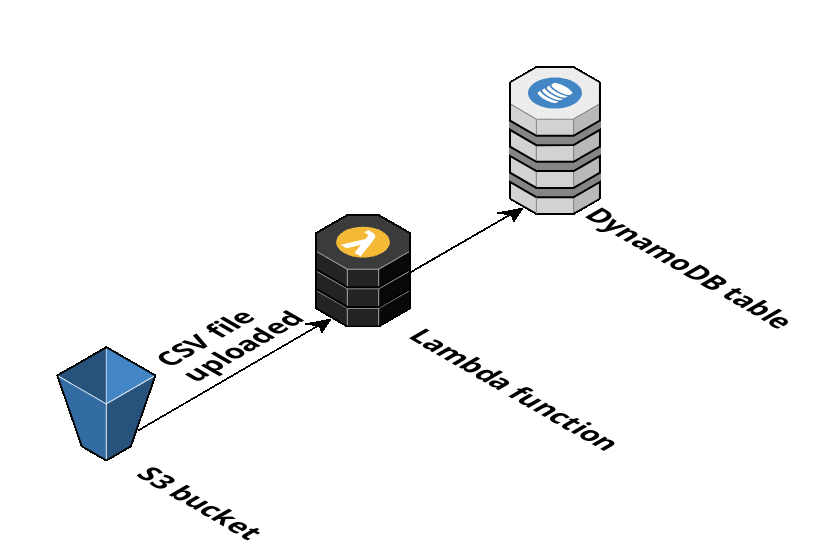

# serverless-csv

Serverless Python application that listens for `S3:ObjectCreated` events, validates that the uploaded file is a valid CSV, parses it and stores the data on a DynamoDB table. Uses [AWS Chalice](aws.github.io/chalice/) and its [Terraform packaging capability](https://aws.github.io/chalice/topics/tf.html).

CSV sample data taken from https://www.appsloveworld.com/sample-csv-file/

## Architecture diagram

## Deployment

The application follows a rolling release method: pushing to `master` will trigger a deployment using Github Actions and Terraform Cloud.

### High-level pipeline overview

1. Install and setup Terraform
1. Install Python dependencies
1. Generate Terraform code from Chalice
1. Validate Terraform code
1. Run Terraform plan and share output on pull request
1. Run Terraform apply when committing to `master`